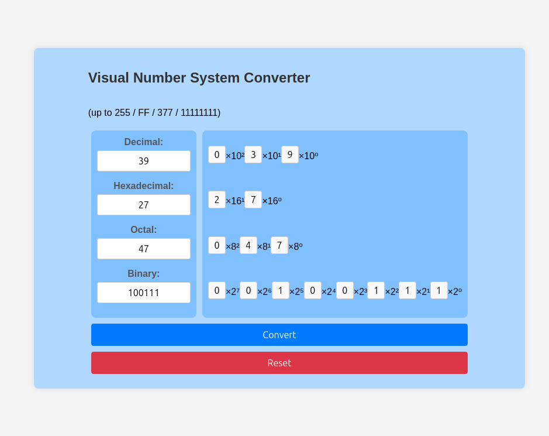

# Visual Number System Converter
### Live preview:
https://stingray-app-k8dbw.ondigitalocean.app/ 

or 

https://mo8.hackclub.app/

Compare the difference between:
- Denary (Base-10 / "normal numbers"), 
- Hexadecimal (Base-16), 
- Octal (Base-8) and 
- Binary (Base-2). 

Picture:



# Instructions:
- Download index.html, styles.css and, script.js into a folder.

If git is installed you can use this command
```
git clone https://github.com/mo8codes/base-conversion
```

- Open index.html using your web browser of choice.
- Enter whichever number you want to be converted to the others.
- Click convert
- To converter another number press the reset button first.